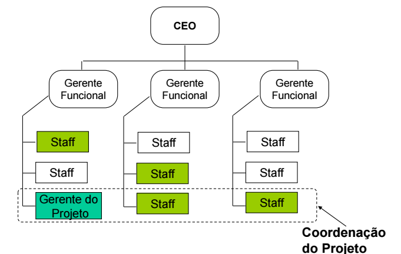
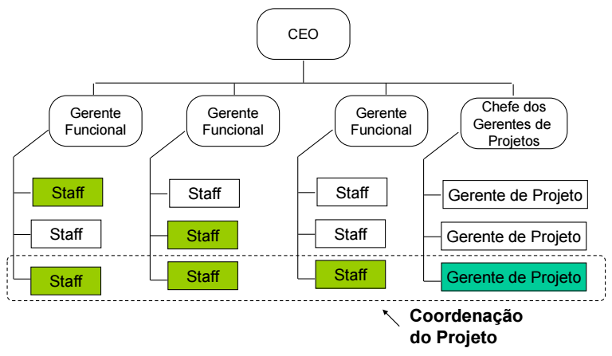
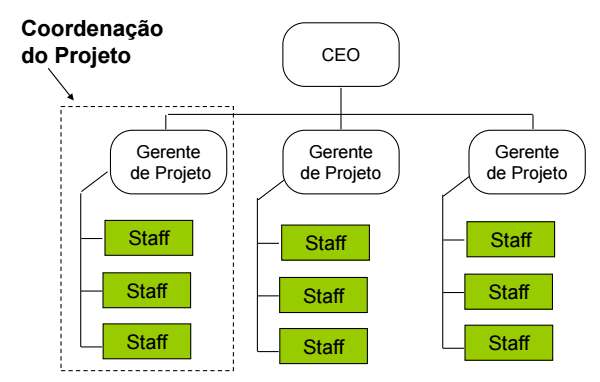

# Aula 3

## O ciclo de vida dos projetos

### Iniciação
**Termo de abertura**  
**PM Canvas**: Project Manager Canvas  
**Identificação dos Stakeholders**: Identificação de quem são as partes interessadas do projeto (são 4 tipos e vamos aprender a identificar cada um deles)  

### Planejamento
**PGP**  
**EAP**: Estrutura Analitica do Projeto  
**Declaração de Escopo**: Formaliza o que vai fazer no projeto (vai dizer o que você não vai fazer no projeto)  
**Aprovação do Plano do Projeto**  
**Reunião de Partida (Kick Off Meeting)**  
**Linhas de Base (baselines)**: Existe 3 linhas de base (linha de escopo, linha de tempo, linha de custo)  

### Execução e controle
**Progresso**  
**Controle de Mudanças**: Proteger o projeto do que foi previamente planejado  
**Entregas Parciais**  

### Encerramento
**Compilação das Lições Aprendidas**: Note que você vai anotando as lições aprendidas durante todo o ciclo, aqui é apenas a compilação  
**Entrega do Produto Final**  
**Aprovação do Cliente**  
**Fechamento dos Contratos**  

## Influências Organizacionais
Como a estrutura da empresa atrapalha ou ajuda a gerênciar projetos.  

### Organização Funcional
Cada coluna de Gerente Funcional é um área (por exemplo, área de TI, área de Engenharia, ...).  
Cada Staff em verde foi a pessoa selecionada da área para o projeto.  

Vantagens:
* Garante que vai ter o recurso técnico. Já que Gerente Funcional é chefe da Staff, a Staff não pode recusar trabalhar no projeto(ao menos que queira ser demitido).  

Desvantagens:
* Gerente Funcional já tem que gerênciar as áreas deles, agora vai ter que gerênciar projetos também.  

### Organização de Matriz Fraca
Cada Gerente Funcional delega a Gestão de Projeto para alguém da Staff.  

Vantagens:
* Garante os recursos técnicos. Pois você seleciona um membro de cada área.

Desvantagens:
* Coordenação feita. Tudo tem que falar com o Chefe.
* Conflito. Quem não foi selecionado para a Gestão do Projeto pode não gostar, isso causa rivalidade.

### Organização de Matriz Balanceada
Dentro das pessoas selecionadas na matriz fraca uma é capacitada em Gestão de Projetos, ou seja, vira Gerente do Projeto.

Vantagens:
* Acaba com o conflito da Matriz Fraca, pois um é capacitado na área, ou seja, ele foi selecionada justamente por causa dessa qualidade.

Desvantagens:
* Vai dar mais atenção para o projeto dentro da área dele.  
* Pode acontecer conflito entre Gerente Funcional e Gerente do Projeto.
* Agora está sobrecarregando alguém que tem que fazer o trabalho da área dele + gerênciar projeto.

### Organização de Matriz Forte
Existe tem uma área de Gerentes de Projetos, onde os Gerentes de Projetos tem o mesmo nível dos membros da Staff.  
E um Chefe dos Gerentes de Projetos.

Vantagens:
* ?

Desvantagens:
* ?

### Organização Projetizada
Os Gerentes Funcionais viram Gerentes de Projetos.

Vantagens:
* Os Gerente s de Projetos são gerentes mesmo.

Desvantagens:
* Não tem garantia de pessoal técnico. Note que você pega geral de uma mesma área.
