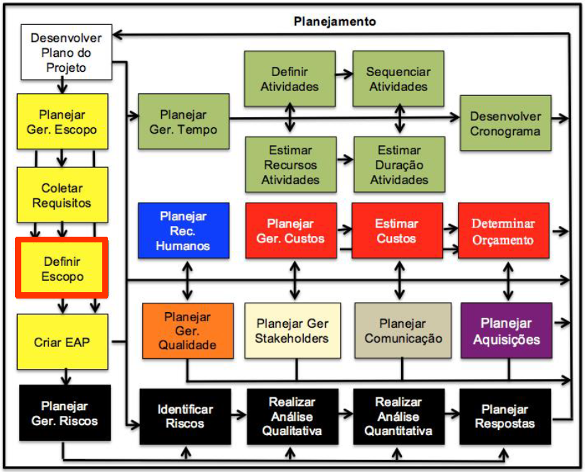
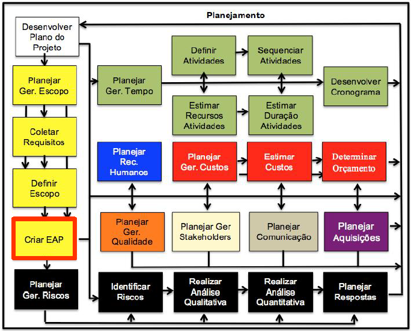
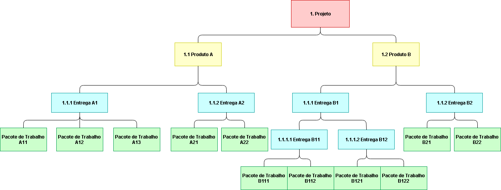

# Aula 8

## Definir escopo  

Criação de um documennto que descreve o projeto e o produto, a diferença dele para os outros é que ele transpassa os outros (passa a ser o mais importante). No momento vamos apenas fazer a primeira versão, mas esse documento é alterado conforme o projeto anda para que esteja de acordo com o projeto.  
Nesse projeto é importante definir as exclusões/limites do projeto (o que o projeto não vai fazer).   

* **Descrição do escopo do produto**: Formalmente o que é o produto.
* **Critérios de aceitação do produto**: São os critérios para que aquelas entregas sejam aceitas.
* **Entregas dos projeto**:
* **Exclusões do projeto**: O que o projeto **não** vai fazer
* **Restrições do projeto**: As mesmas anteriores
* **Premissas do projeto**: As mesmas anteriores

## Criar EAP(WBS)
EAP = Estrutura analítica do projeto  
WBS = Work breakdown structure  

Pegar as entregas definidas na relação de escopo e subdividir em elementos menores porém mais fácilmente gerenciados.  É a ferramenta mais importante para a gerência de projetos na parte do planejamento.  

* EAP divide o resultado do projeto como se fosse um árvore.  
Dentro dessa árvore divide o projeto em partes físicas, quando se trata de produtos, e em grandes tarefas, quando se trata de serviço.   

* EAP te ajuda a ver a natureza do produto ou serviço, olhando a árvore você consegue visualizar o produto.  

* Os elementos da EAP vão ter que ser detalhados em atividades.  

No primeiro momento se desenha a EAP.  
No segundo momento se cria o documento dicionario da EAP.  

Pacotes não podem ser divididos.  
Pacote sempre é folha da árvore.  

Existem 2 pacotes que sempre estão em todas EAP: Gerencia de Projeto e Encerramento.  
Como esses dois trabalhos estão relacionados ao gerente de projeto e não à entrega do projeto, por isso que sempre tem em todos.  

Como você sabe se tem que dividir? Se tem mais do que duas pessoas então tem que dividir.  
Dividiu, como você sabe se tem que dividir de novo? Quando você olha pra ele e você **não** consegue mensurar uma estimativa de tempo.  
Em outras palavras, se você consegue mensurar estimativa de tempo, é pacote.  
