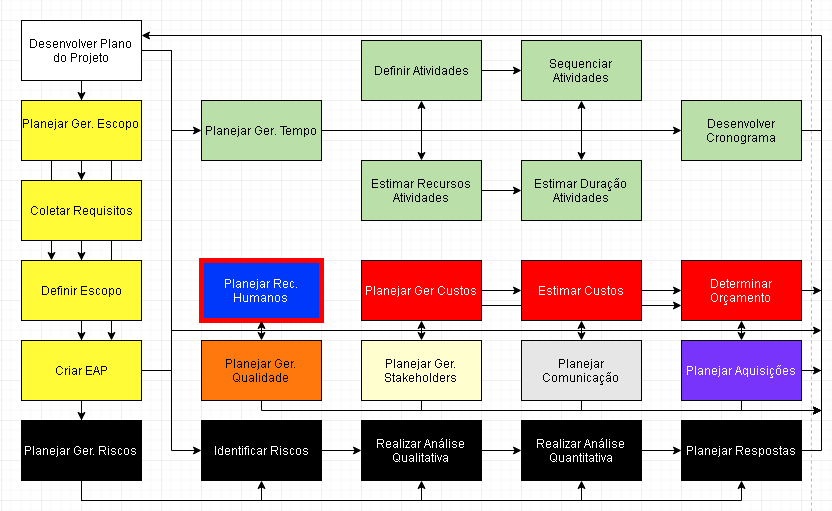
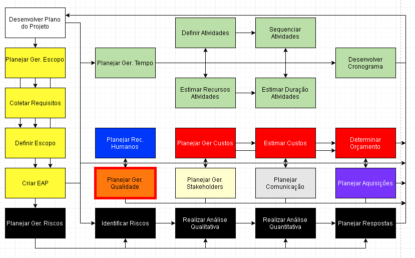
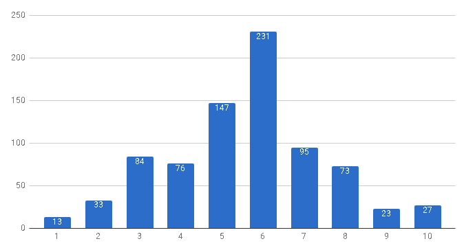
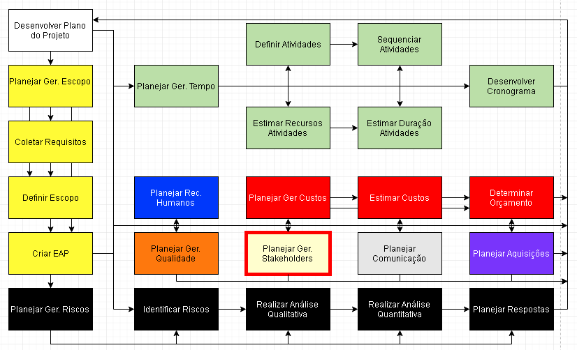

# Aula 12

## Planejar Recursos Humanos
  

### Matriz de responsabilidades  

| Atividades  | Cargo 1 | Cargo 2 | Cargo 3 | Cargo N |
| ----------- | ------- | ------- | ------- | ------- |
| Atividade 1 |         |         |         |         |
| Atividade 2 |         |         |         |         |
| Atividade 3 |         |         |         |         |
| Atividade N |         |         |         |         |

* **Responsável pela execução (Responsible)**: É a pessoa que está trabalhando na atividade.  
* **Autoridade para aprovar (Accountable)**: A pessoa que vai aprovar a atividade e responsável pela entrega do produto.
* **Precisa ser consultado (Consulted)**: Pessoa que é necessária para a realização da tarefa ou que precisa ser consultada para a relização da tarefa.  
* **Precisa ser informado (Informed)**: A(s) pessoa(s) que precisam ser informadas de qualquer ação tomada no projeto.  

### Conteúdo de um plano de gerenciamento de RH
* Necessidade de recrutamente e seleção
* Histograma de recursos
* Critérios de liberação do pessoal
* Necessidades de treinamento
* reconhecimento e premiações
* Estratégias de conformidade com plítica de RH
* Segurança

## Planejar Gerência de Qualidade
Processo responsável por investigar/descobrir os padrões de qualidade para os requisitos, ou seja, o que precisa ser feito para alcançar a qualidade desejada.  

### Ferramentas básicas da qualidades

* Diagrama de causa efeito  
* Lista de verificação  
* Histograma  

#### Diagrama de causa efeito (ou espinha de peixe)
Usado para saber o efeito de uma causa/falha/erro, ou seja, para saber quais causas levam a efeito.  
Normalmente dividem em categorias, por isso que acaba com cara de espinha de peixe.  
  

Esses items que estão como causa, são items que não podem surgir. Se surgirem vai surgir um produto com defeito.  

#### Lista de verificação
Serve para verificar a frequência de falha de cada produto.  

| Produto  | Dia 1 | Dia 2 | Dia 3 | Total |
| -------- | ----- | ----- | ----- | ----- |
| Waffer   | 100   | 50    | 50    | 200   |
| Recheado | 50    | 70    | 80    | 200   |
| Salgado  | 50    | 50    | 55    | 155   |
| Leite    | 80    | 85    | 79    | 244   |

#### Histograma
Dias dos projetos e quantidade de tempo que foi trabalhado no projeto.  
Eixo X é dia 1/2/3...  
Eixo Y é o tempo em horas gasto no projeto.  
  

### Matriz de qualidade
Para cada requisito não funcional, você deve deixar claro tudo para o requisito alcançar a qualidade desejada.  
Como você mede se o requisito não funcional está funcionando? Usando essa tabela.   

Requisito de qualidade: Requisito a ser analisado.   
Ações para atingimento: Ação a ser tomada para que aumente o requisito não funcional esteja como desejado.  
Indicadores: Indicadores/valores para sabermos se estamos alcançando o requisito.  
  

## Planejar Gerência de Stakeholders
  

Continuidade da matriz stakeholders que tinhamos, agora vamos botar eles em uma das 5 categorias e dizer onde queremos que eles parem:  
* **Desconhecedor** (Unware): Desconhece o projeto e os seus impactos potenciais.
* **Resistência** (Resistant): Conheceu o projeto e ficou contrário ao projeto.
* **Neutro** (Neutral): Conheceu o projeto e ficou indiferente ao projeto.
* **Ciente** (Supportive): Conheceu o projeto e ficou favorável ao projeto.
* **Apoiador** (Leading): Conheceu o projeto e ficou ativamente ajudando.

| Grau de envolvimento do Stakeholder | Atual         | Desejável   |
| ----------------------------------- | ------------- | ----------- |
| Stakeholder A                       | Desconhecedor | Apoiador    |
| Stakeholder B                       | Desconhecedor | Neutro      |
| Stakeholder C                       | Neutro        | Ciente      |
| Stakeholder C                       | Resistência   | Neutro      |

