# Aula 10
Vamos começar a ver processos de tempo:  
* Planejar gerenciamento de tempo  
* Definir atividades  
* Sequênciar atividades  
* Estimar recursos de atividades  
* Estimar duração de atividades  
* Desenvolver cronograma  

## Planejar o Gerenciamento do Tempo

Tem a função de decidir/criar o plano para gerênciar o cronograma, ou seja, as regras para você criar tudo relacionado a tempo. Nele você decide:  
* O modelo do cronograma
* Nível de precisão das durações
* Unídade de medida de tempo (dia/mês/hora/minuto)
* As regras de medição de desempenho
 
Na EAP, nós não obdecemos nenhuma ordem lógica de trabalho, apenas listamos pacotes e atividades. Nós iremos botar em ordem lógica quando estivermos em "Sequenciar atividades".  

## Definir Atividades
As ações que precisam ser feitas para se completar pacotes de trabalho que vão produzir as entregas do projeto.  
Com base nos pacotes de trabalhos da EAP, nós listamos as atividades necessárias para fazer o futuro cronograma.  
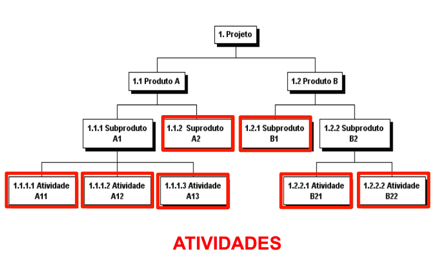

Nessa imagem aquele subproduto é como se fosse um pacote.

## Sequênciar Atividades
Depois de lista as atividades, precisamos sequênciar elas, botar em uma ordem lógica. A ordem em que vai ser feito.  
Isso nos ajuda a ver que atividade precisa que outra seja feito primeiro, ou quais podem ser feito em paralelo.  
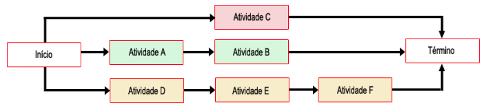

### Diagrama de rede
Um diagrama que além de mostrar a ordem que precisa ser feito, mostra quais são dependentes das outras atividades.  
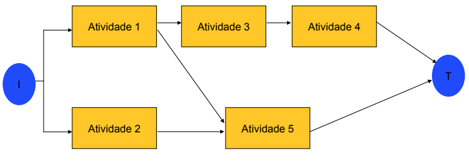

Outra maneira que esse diagrama pode ser representado é por uma tabela.  
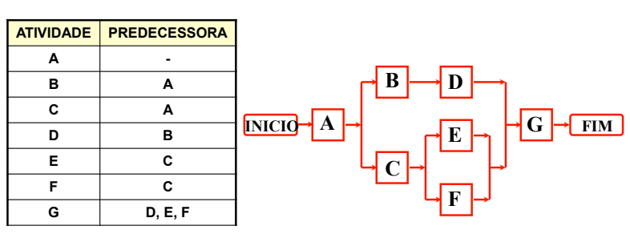

### Dependências
Existe 3 tipos de dependências:  

**Dependências Obrigatórias**:  
Uma atividade depende da outra para começar.  
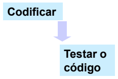  
Só pode testar o código depois que escrever ele.  

**Dependências Arbitradas**:  
Vai depender da decisão da empresa/gerente.  
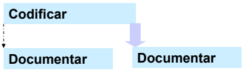  
Você pode escrever o código e ir documentando conforme escreve **ou** escrever o código e depois documentar.  

**Dependências Externas**:  
É como se fosse uma dependência obrigatória porém é não depende do grupo/equipe fazer algo, mas sim de alguém de fora fazer algo.  
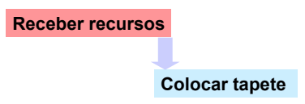  
Nesse caso a equipe quer colocar um tapete na sala, mas primeiro tem que receber o tapete para botar, como a atividade receber o tapete não depende da equipe para terminar mas sim dos fornecedores, virar uma atividade externa.  

### Relações lógicas  
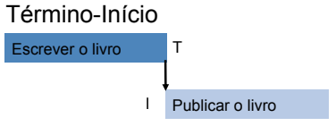  
Atividade só começa depois que uma outra terminar.   

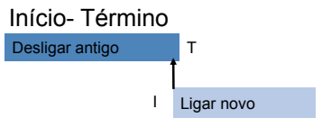  
Quando uma atividade iniciar, a outra tem que terminar.  
Qual diferença dessa para anterior?  
A anterior é: Só pode começar a testar depois que escrever o código.  
Essa é: Quando a dia 20 chegar, nós temos que lançar o programa.  

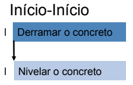  
Duas atividades tem que começar na mesma data.  

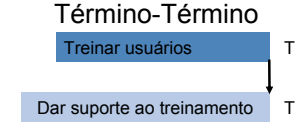  
Duas atividades tem que terminar na mesma data.  

## Estimar Recursos de Atividades
Estimar os recursos necessários para cada atividade.  
Saber que pessoas vão atuar em cada atividade (os perfis que vão trabalhar naquele projeto).  
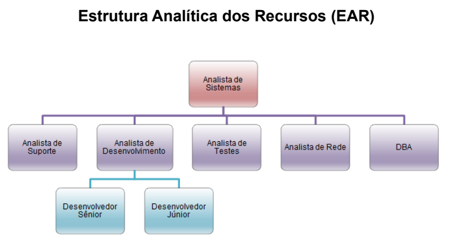

## Estimar Duração de Atividades
Vamos estimar a duração de cada atividade.  
Existem 3 tipos de estimativas:  
* **Estimativa análoga**: Estimativa baseada em projetos parecidos anteriores, informações históricas e opinião de especialistas.  
  * "Demorou 4 dias para fazer esse tipo de coisa na outra empresa"  
  * "A anos faço isso e o que você está pedindo costuma levar 7 dias"   
* **Estimativa paramétrica**: Calculada baseada em parâmetros. Se fazer uma parte da atividade leva X dias, então fazer uma atividade igual três vezes maior, vai levar 3X.  
 * Tempo por linha de código  
 * Tempo por metro linear  
 * Tempo por instalação  
* **Estimativa de Três pontos**: Trabalha com 3 variáveis. É chamado de "Otimista, Mais provável, Pessimista", eu chamaria de "Melhor caso, caso médio, pior caso".  
 * No melhor caso essa atividade demora 2 dias, o mais provável é que dure 6 dias, no pior caso é 14 dias. Calculando chegamos a conclusão que deve demorar 6.6 dias.  
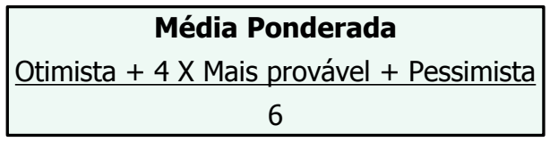 
