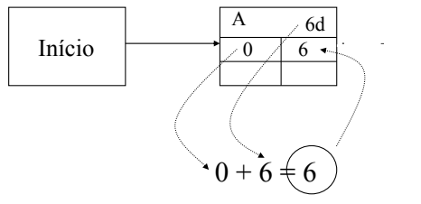
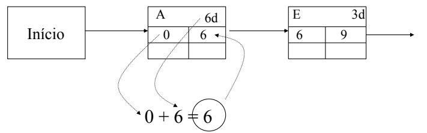
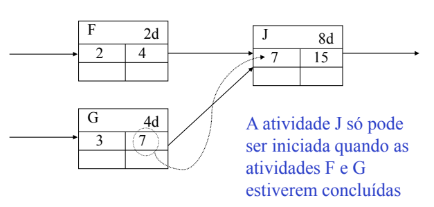
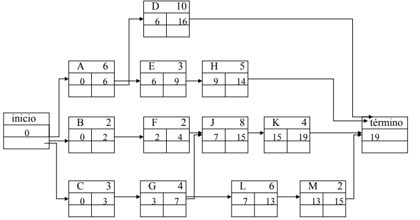
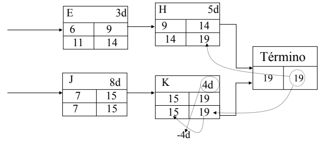
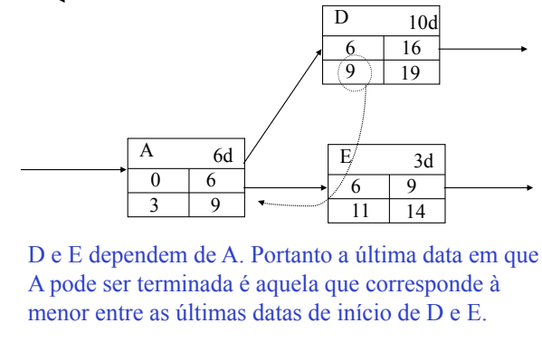
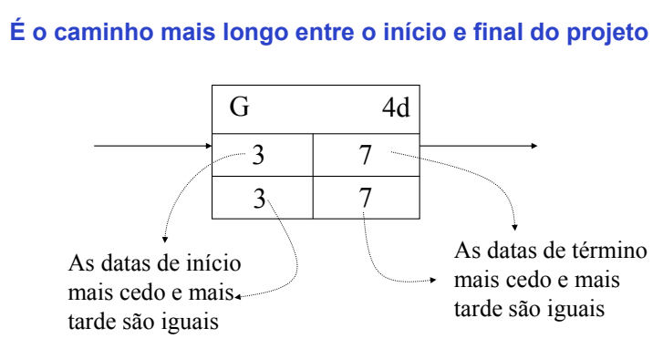
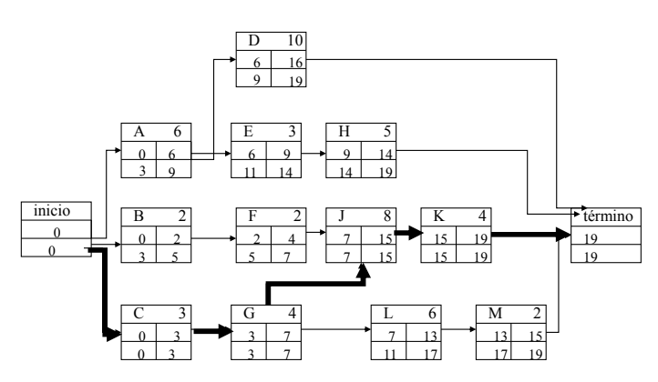

# Aula 11

## Desenvolver o Cronograma

### Caminho Crítico
Antes de descobrir se um caminho é crítico você tem que para cada atividade calcular:  
As datas de **início cedo** e **termino cedo**  
E as datas de **início tarde** e **término tarde**  

Lembrando que esses calculos são sem considerar limites de recursos.

**Caminhos críticos** são os piores caminhos do projeto. Você pode notar pelas caracteristicas do caminho crítico:  
  
Folgas são o intervalo de tempo entre uma atividade e outra. Como caminhos críticos não tem folga, ao termina uma atividade desse caminho, você deve começar outra atividade. Isso também quer dizer que se uma atividade crítica atrasar, o projeto também vai atrasar.  

Representação adotada - PDM  

### Como calcular caminho crítico
Para começar suponha que tenha uma rede tipo essa.  
  

Vamos começar calculando se começarmos todas as atividades primarias logo no primeiro dia, no tempo 0.  
Se a atividade A tem duração 6 dias e começou no dia 0, vai terminar justamente no dia 6.  
  

Logo o **início cedo** é 0.  
O **término cedo** é 6.  

A atividade em seguida dessa vai começar quando essa terminar, vai durar quanto tempo ela tem que durar e vai ser calculado uma data de término cedo.  
  

O que acontece se a próxima atividade for dependente de mais que uma atividade? Ela apenas começa quando todas as atividades que ela for dependente terminarem.  
Se ela é dependente de 10 atividades, 9 delas terminam no dia 1. Você ainda vai ter que esperar a com maior tempo.  
Logo a data de início cedo acaba sendo a data de término cedo da maior.  
  

Terminando de calcular a rede anterior  
  

Agora que sabemos quando o projeto deve terminar podemos calcular o quanto podemos "enrolar" para começar cada atividade, ou seja, o início tarde e término tarde.  
Como isso funciona, vendo que o término é dia 19 conseguimos ver que no pior caso D, H, K e M podem terminar dia 19 que ainda estaria tudo bem (D,H,K e M são todos necessários para terminar o projeto).  
Olhando H, se H pode terminar até dia 19 e demora 5 dias, quer dizer que pode enrolar até o dia 14 para começar e não estaria atrasando o projeto.  
  

Se uma atividade pode enrolar até dia 9 e outra até dia 11, e essas ambas atividades só podem vem de uma mesma, quer dizer que você só pode enrolar até o menor número entre elas, ou seja, dia 9.  
Se você enrolasse até o dia 11, você estaria atrasando a outra atividade em 2 dias.  
  

Com isso você consegue descobrir as "atividades críticas", são as que as datas não podem ser alteradas.  
Ou seja, a data de início cedo é igual a de início tarde **e** data de término cedo é igual a de término tarde.  
  

Resolvendo aquela rede, podemos ver que o caminho crítico é aquele formado por atividades críticas.  
  

### Como calcular folgas

