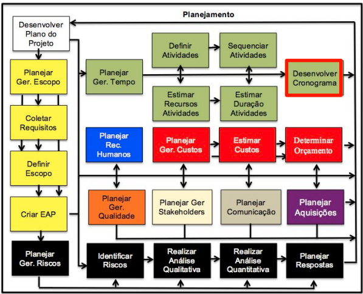
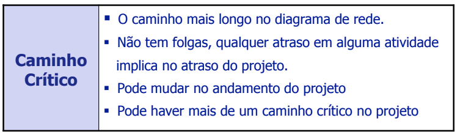
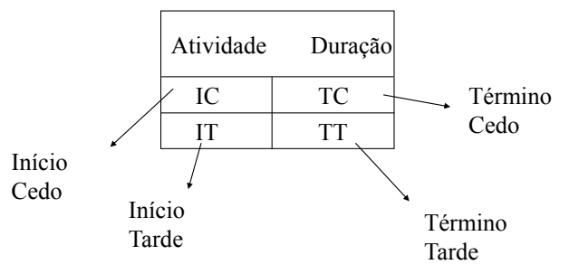
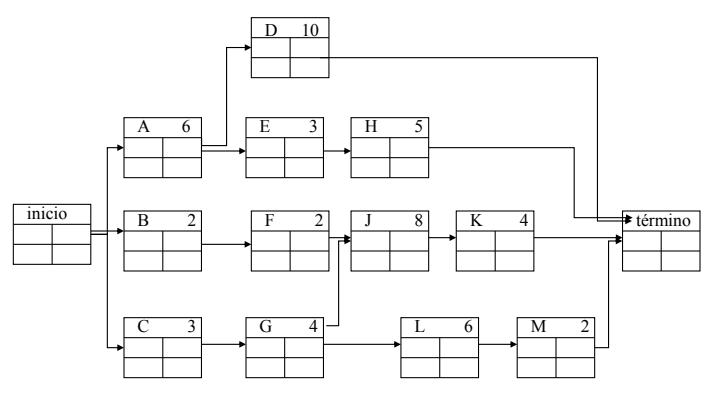

# Aula 11

## Desenvolver o Cronograma

### Caminho Crítico
Antes de descobrir se um caminho é crítico você tem que para cada atividade calcular:  
As datas de **início cedo** e **termino cedo**  
E as datas de **início tarde** e **término tarde**  

Lembrando que esses calculos são sem considerar limites de recursos.

**Caminhos críticos** são os piores caminhos do projeto. Você pode notar pelas caracteristicas do caminho crítico:  
  
Folgas são o intervalo de tempo entre uma atividade e outra. Como caminhos críticos não tem folga, ao termina uma atividade desse caminho, você deve começar outra atividade. Isso também quer dizer que se uma atividade crítica atrasar, o projeto também vai atrasar.  

Representação adotada - PDM  

### Como calcular caminho crítico
Para começar suponha que tenha uma rede tipo essa.  
  
