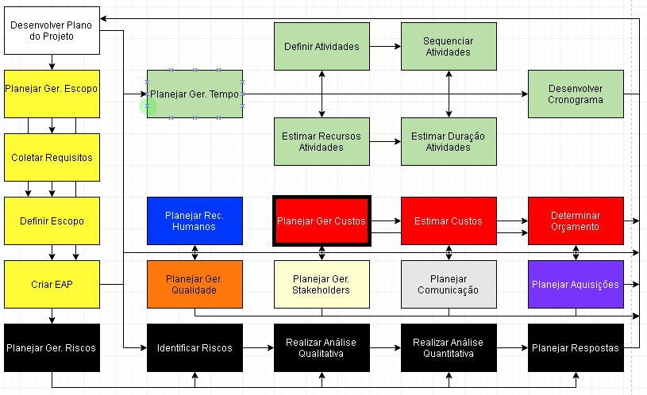
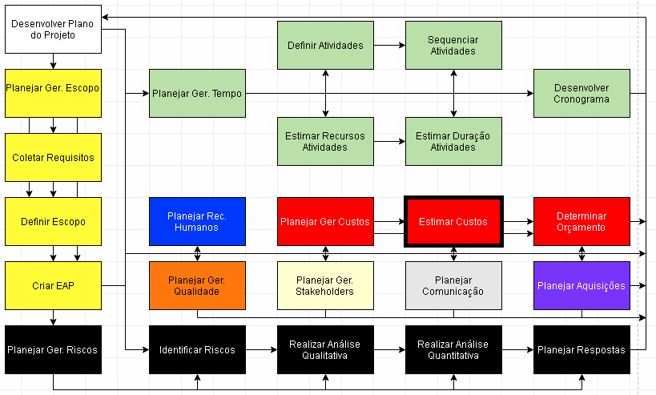
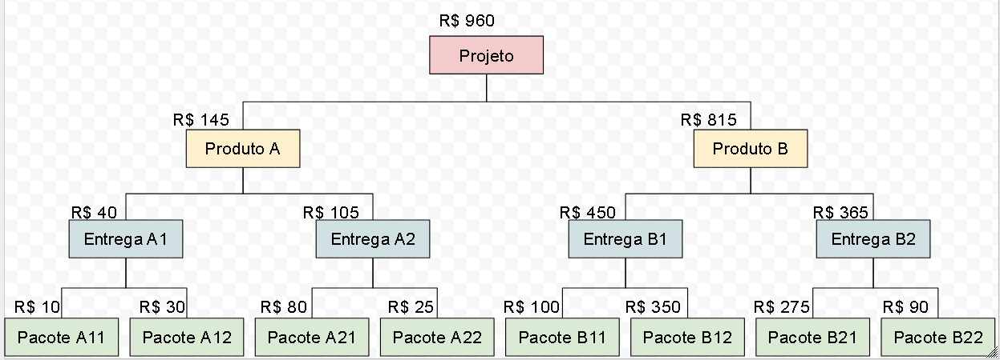
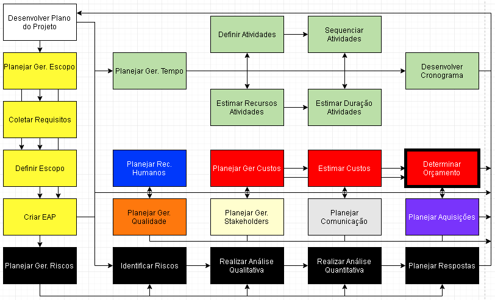
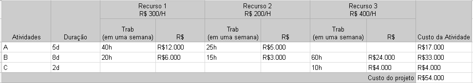
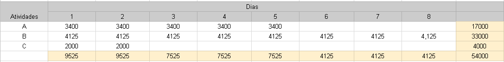

# Aula 12

## Planejar Ger. Custos

Estamos falando de custos de coisas e precisamos gerenciar isso, para ajudar isso você estabelece coisas como:
* **Unidades de medidas a serem utilizadas**: Real(R$) ou Dolar($) ou ...
* **Nível de precisão de arredondamento**: O arredondamento dos números, dos custos
* **Nível de confiabilidade aceitável das estimativas**: O quanto % desse projeto você pode errar, vai que você chuta que vai custar $1000 e no final sai $1300, você errou em 30%. Normalmente a estimativa de erro é entre 5% e 10%
* **Regras de medição de desempenho**: 
* **Definição dos formatos dos relatórios de custo**: 
* **Descrição de como os processos de gerenciamento dos custos serão conduzidos e documentados**: Dita as regras de gestão de custos do projeto

## Estimar Custos

Olhando todas as atividades que já foram definidas, você deve calcular os custos para elas.  
O orçamento não é necessariamente o orçamento final.  

Maneiras de estimar custo: 
* **Estimativa por analogia (top-down)**: Se um projeto parecido anterior custo R$1000, o nosso deve custar o mesmo*
* **Estimativa paramétrica**: Se fazer 1/4 do projeto custa R$400, então fazer ele todo custa 4x400 = R$1600*
* **Estimativa de Três Pontos**: Melhor caso + 4x caso médio + pior caso, tudo isso dividido por 6*
* **Estimativa bottom-up**: Estimar o custo do projeto olhando de baixo para cima, usando o custo dos de baixo para descobrir o custo dos de cima.  
  * 

\*Funcionam que nem a estimativa de tempo

## Determinar Orçamento

**Estimativas de custos dos pacotes de trabalho projeto**: Justamente a estimativa feita anteriormente, por exemplo a bottom-up  
**Reserva de contingência**: É o orçamento guardado para riscos (problemas que podem acontecer durante o projeto)  
**Linha de base de custos**: ?  
**Reserva de gerenciamento**: ?  
**Orçamento final do projeto**: ?  

### Planilha de custos
  
**Recurso** = Uma pessoa trabalhando  
**Trab** = O quanto essa pessoa trabalho dentro de uma semana (geralmente é quanto ela trabalho em 5 dias pois sabado e domingo não conta)  

### Orçamento Previsto

Basicamente você faz uma planilha, sendo os dias a atividade com maior dias daquele pacote.  
O quanto vai ser gasto em cada dia da atividade é o custo total antes calculado / dias.  
No final você soma o quanto você vai gastar em cada dia para saber o gasto por dia.  
