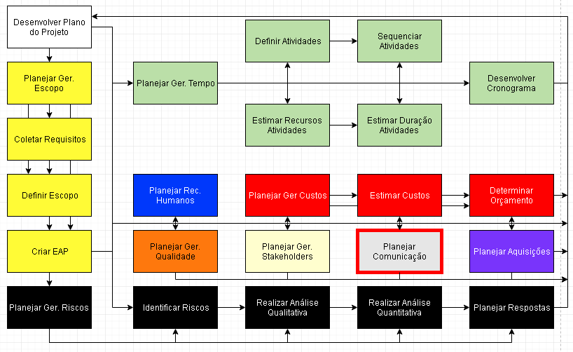
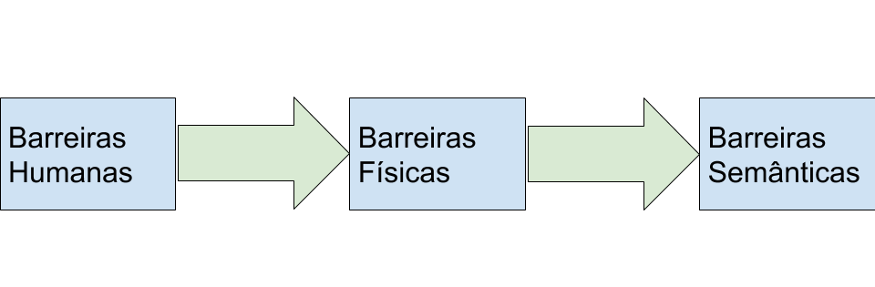
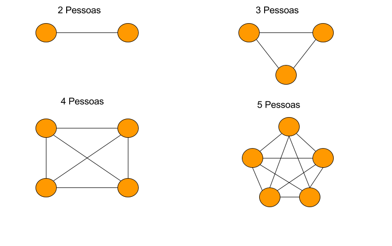
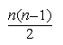
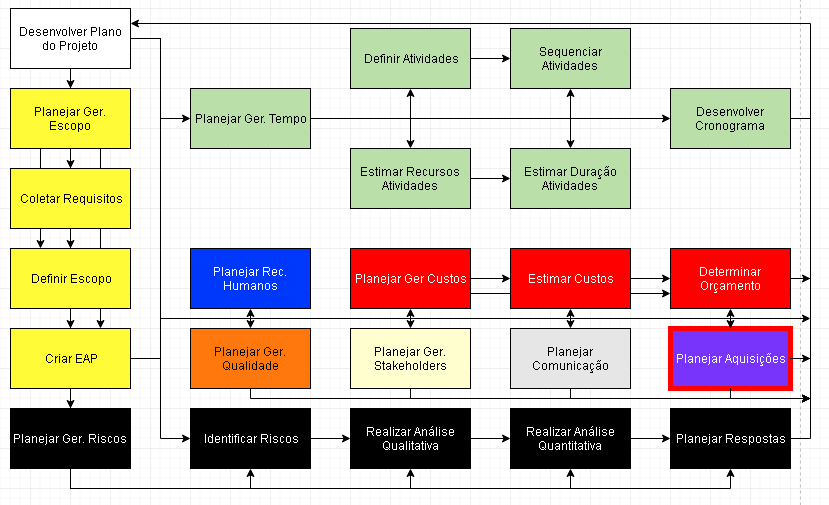
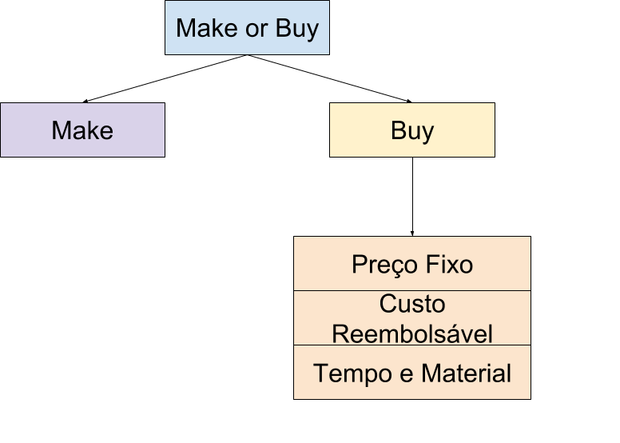

# Planejar Comunicação
Planejar e botar em prática como se comunicar com os stakeholders.  
Todo stackeholder na nossa matriz tem que ir parar na matriz comunicação.  
  

## Barreiras em comunicação
Barreira/ruídos são dificuldades que podem ocorrer quando necessita passar informação de uma pessoa para outra.  

### Barreiras humanas
* **Limitações pessoais**
  * A pessoa fala baixo
  * A pessoa é gago
  * A pessoa não sabe falar a língua
  * A pessoa é muda
* **Hábito de ouvir**
  * Não espera a outra terminar de falar e já começa a falar
* **Desinteresse**
  * Não mostrar interesse no que a pessoa está falando
* **Atitudes antagônicas**
  * Uma pessoa não gosta da outra
  * Uma pessoa não quer falar com a outra
  * Uma pessoa é hostil
* **Preconceitos pessoais**
  * Preconceito racial
  * Preconceito religioso
  * Preconceito do gênero
  * Analisa a pessoa visualmente e acha que a pessoa não sabe falar ou é idiota ou outras coisas...
* **Emoções**
  * A pessoa está irritada
  * A pessoa está triste
  * A pessoa está alegre demais (as vezes enche o saco)
* **Pressa**
  * Pessoa falar as coisas com pressa

### Barreiras físicas
* **Espaço físico**
  * Não ter uma sala para sua área de trabalho
* **Interferências físicas**
  * Som alto atrapalhando o trabalho
* **Falhas mecânicas**
  * Quebrar o microfone
  * Quebrar o ar condicionado
  * Quebrar o datashow

### Barreiras semânticas
* **Erros de escrita**
  * Escrever errado
  * Falar errado
* **Interpretação das palavras**
  * Em uma conversa no whastapp/facebook não tem como saber se a pessoa for sarcastica
  * Palavras com o mesmo sinônimo
* **Tradução da linguagem**
  * Varias expressões que em um local quer dizer uma coisa e outro lugar é outra coisa
  * Erros de concordância
* **Significado dos sinais e símbolos**
  * Quando você vê uma sala com uma placa caveira, quer dizer que tem alguma coisa tóxicas
  * Quando você vê uma sala com uma placa de raio, quer dizer que tem alguma coisa que da choque
* **Cultura**
  * Certas coisas para um país é normal e em outro não é

## Requisitos de comunicação
Quanto mais pessoa maior a quantidade de canais de comunnicação.  
  
A formula para saber quantos canais de comunicação vão ser é  
  

2 pessoas = 1 canal  
3 pessoas = 3 canais  
4 pessoas = 6 canais  
5 pessoas = 10 canais  

## Métodos de comunicação
**Comunicação interativa**: Comunicação onde a resposta é instantânea, ou seja, uma outra pessoa pode reagir na hora sobre uma informação que você passou.  
* Reuniões  
* Conferência por telefone  
* Videoconferência  

**Comunicação ativa**: Comunicação onde um lado passa informação pro outro, ou seja, a outra pessoa vai receber a informação mas não vai ter chance de interromper a outra caso algo esteja errado.  
* E-mail
* Fax
* Relatórios
* Correio de voz
* Comunicados na imprensa
* Cartas
* Memorandos

**Comunicação passiva**: Comunicação onde o outro lado tem que ir buscar a informação, ou seja, você deixa a informação em algum lugar e o outro lado da comunicação tem que ir olhar.  
* Intranet
* E-learning
* Repositórios de conhecimento
* Bota a informação em um site

## Matriz de comunicação
Conhecido como 5W2H  
**W**ho: Quem necessita? Quem envia?  
Quem está enviando e quem está recebendo, na nossa matriz isso seria os stakeholders.  
**W**hat: Qual informação?  
Qual a informação que você vai passar, seja ela passiva, ativa ou interativa.  
**W**hy: Porque será informado?  
Qual o objetivo de passar essa informação. Aqui que você tenta atender a 'estratégia para o stalkeholder'.  
**W**hen: Quando será informado?  
Quando que vai ser informado, diaramente, mensalmente, a cada x dias, eventulamente...  
**W**here: Onde acessar/armazenar?  
Local onde você vai disponibilizar para passar informação pássiva.  
**H**ow: Como será fornecido?  
Qual ferramente vai usar para disponibilizar a informação. Pen drive, email, facebook, whatsapp, botar em um site...  
**H**ow much: Quanto custará a disponibilização?  
Custo de passar essa informação, se for botar em site, geralmente tem custo pagar o site.  

| What             | Why                                                      | Who          | When        | Where              | How  |
| ---------------- | -------------------------------------------------------- | ------------ | ----------- | ------------------ | ------ |
| ---------------- | -------------------------------------------------------- | ------------ | ----------- | ------------------ | ------ |

Exemplo de matriz comunicação:

| Item de comunicação  | Propósito | Emissor | Quando | Meio de comunicação | Como |
| -------------------- | --------- | ------- | ------ | ------------------- | ---- |
| Status Report Diário | Informar o sponsor sobre andamento do projeto | Gerente de projetos | Sponsor | Diário | Email | Template do status report |
| Controle de gastos | Informar ao gerente de projetos sobre os gastos do projeto e possíveis gastos mão previstos | Gerente de negócios | Gerente de projetos | Eventual | Reunião | Tempalte de ata de reunião |

**Temos que comunicar todos os stakeholders do projeto da maneira que eles querem ser comunicados**

### Tipos de comunicações a serem inseridas na matriz
**Obrigatórias**  
Quando uma informação é passada por obrigação, seja regras da empresa, ou indústria, ou pela força da lei. Informação que você tem que passar aos stakeholders.  
Exemplos: Relatórios, reuniões de andamento do projeto, relatórios exigidos pelos acionistas, relatórios exigidos pelo conselho de diretores, relatórios exigidos pelo governo, relatórios financeiros...  

**Informativas**  
Quando uma informação é passada pois vocês acham que é importante informar. Normalmente você passa informação que você acha que interessa os stakeholders.  
Exemplos: **F**requented **A**sked **Q**uestions, entregas do projeto, informações sobre o projeto...  

**Marketing**  
Quando uma informação é passada de maneira a promover o projeto,  ou aumentar o entusiasmo sobre o projeto. Geralmente muda a forma como as pessoas executam seus trabalhos, pode dar um boost na equipe/empresa.  
Exemplos: Boletim informativo sobre o projeto com informações positivas, palestras, apresentações, concursos com prêmios simpless para criar entusiasmo, souvenirs com logo ou nome do projeto.  

# Processos do Planejamento
  
Nessa parte você descobre os items que precisam ser comprados e quais precisam ser feitos.  

## Make or Buy
**Make**: Entrega vai ser feita toda internamente.  
**Buy**: Entrega vai ser feita com contratação externa.  

