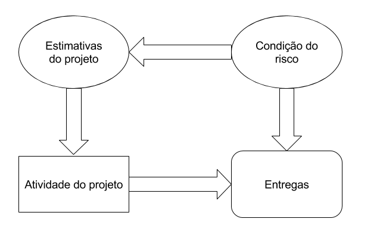

# Planejar o gerenciamento dos riscos  
  

## Definição de Risco
Risco é uma incerteza que, se ocorrer, pode ter um efeito positivo ou negativo sobre um ou mais objetivos do projeto.

**Sintomas**(trigger): Mostra sinal de que algum risco existe.  
* Quando você começa a tossir, é um sintoma que mostra que tem o risco de você ficar gripado.  
* Quando a maquina começa a ficar lenta, é um sintoma que tem o risco da maquina pode parar.  

**Causa raiz**: Faz o risco existir.  
* Se você tem o risco da maquina parar, a causa raiz pode ser que o seu sistema é muito pesado ou não tem uma boa manutenção.  

**Probabilidade**: A probabilidade do risco acontecer.  

**Impacto**: O impacto que o risco traz se acontecer, seja impacto positivo ou negativo.  

**Gerência de riscos** é você tentar maximizar as oportunidades(riscos positivos) e minimizar as ameaças(riscos negativos).  

## Exposição ao risco
Exposição ao risco = Probabilidade x Impacto  
  

Nós temos que nos precupar com os 4 riscos, pois eles podem ir mudando conforme o projeto (impacto crescer/diminuir, probabilidade crescer/diminuir)  

## Percepção de Risco

**Risk-Taker**: Pessoas que gostam de correr risco. Por exemplo, pessoas que tem aplicação na bolsa de valores.     

**Risk Neutral**: Meio termo entre os dois.    

**Risk Avoider**: São avesso ao risco, ou seja, evitam riscos.    

## Estrutura Analítica do Risco (EAR)
Escolher quais são as categorias dos riscos, isso é útil para a organização dos riscos.  

  

## Conteúdo de um plano de gerência de riscos
Fala o que acontece numa gerência de riscos, em outras palavras fala de:  
* Metodologia
* Papéis e responsabilidades
* Recursos para gerenciar os riscos
* Frequência em que os riscos serão monitorados
* Categorias de risco a serem utilizadas (EAR)
* Definição de níveis de probabilidade e impacto (baixa, média, alta)
* Revisão das tolerâncias das partes interessadas
* Formatos de relatórios
* Acompanhamento

# Identificar Riscos
  

## Ferramentas de identificação dos riscos

### Revisões de documentações
**Analogia interna**: Olhando tudo que vocês fizeram até agora.  
**Analogia externa**: Olhando tudo que outros projetos similares ao de vocês fizeram.  

### Técinicas de diagramas
**Diagrama de causa e efeito (ou espinha de peixe)**  
  
**Diagrama de influência**  
  
**Fluxograma**  
  

### Técnicas de coleta de informações
**Brainstorming**: Todo mundo fica numa sala física e começa a olhar as categorias do projeto e identificar os riscos.    
**Brainwriting**: O mesmo que brainstorming mas sem ser físicamente no mesmo lugar  
**Delphi**: Uma pessoa recebe todos os riscos e ele compila/filtra todos os riscos  

### SWOT
**S**trength, **W**eakness, **O**pportunities and **T**hreats.  
Não é tão usado pelo pessoal.  
  

# Realizar análise qualitativa
  

## Matriz GUT
**G**ravidade, **U**rgência e **T**endência.  

| Pontos | Gravidade | Urgência | Tendência |
| ------ | --------- | -------- | --------- |
| 5 | Os prejuízos ou dificuldades são extremamente graves | É necessária uma ação imediata | Se nada for feito, o agravamento da situação será imediato |
| 4 | Muito graves | Com alguma urgência | Vai piorar a curto prazo |
| 3 | Graves | O mais cedo possível | Vai piorar a médio prazo |
| 2 | Pouco graves | Pode esperar um pouco | Vai piorar a longo prazo |
| 1 | Sem gravidade | Naõ tem pressa | Não vai piorar ou pode até melhorar |

Exemplo:  

| Riscos  | G   | U   | T   | Total | Priorização |
| ------- | --- | --- | --- | ----- | ----------- |
| Risco 1 | 3   | 5   | 2   | 30    | 2           |
| Risco 2 | 4   | 2   | 2   | 16    | 4           |
| Risco 3 | 2   | 3   | 4   | 24    | 3           |
| Risco 4 | 4   | 3   | 4   | 48    | 1           |

**Total** é calculado multiplicando o pontos do G, U e T.  
Risco 1 Total = 3x5x2 = 30  
Risco 2 Total = 4x2x2 = 16...  

**Priorização** é botar em ordem do maior total ser o número 1, o próximo maior ser 2...  

# Realizar análise quantitativa  
  

## Ferramentas de quantificação dos riscos
**Valor esperado do risco**  
Valor Esperado = Probabilidade x Impacto  

**Valor esperado do projeto**  
Valor Esperado = Valor Base + ∑ VE Ameaças - ∑ VE Oportunidades  

**Exemplo**:  
Orçamento base do projeto XPTO = 3.000.000,00  

| Evento do risco      | Probabilidade | Impacto       | Valor esperado |
| -------------------- | ------------- | ------------- | -------------- |
| Greve de fornecedor  | 50%           | +R$500.000,00 | +R$250.000,00  |
| Protótipo funcionar  | 20%           | -R$200.000,00 | -R$40.000,00   |
| Perder recurso-chave | 90%           | +R$5.000,00   | +R$4.500,00    |

Somatório dos valores esperados: 214.500,00  
Valor esperado do projeto = R$3.214.500,00 (3.000.000,00 + 214.500,00)  

  

# Planejar respostas
  

## Resposta aos riscos

**Contenção (ameaça)**: Antes do risco virar um fato, mas tentando fazer não acontecer.  
**Contingência (ameaça)**: Depois que vira um fato, tentando diminuir o efeito/prejuizo.  

**Alavancagem (oportunidade)**: Antes do risco virar um fato, mas tentando fazer que aconteça.  
**Aproveitamento (oportunidade)**: Depois que vira um fato, tentando aproveitar o máximo possível.    

### Respostas para riscos negativos
* **Prevenção/Eliminação**: Eliminar a chance do risco acontecer.
* **Mitigação**: Não elimina o risco, mas diminui a chance dele acontecer.
* **Transferência**: Passa o risco para outra pessoa/empresa.  
* **Aceitação**: Não tem nada que você possa fazer então você apenas aceita e prepara para as consequências. Passiva: Não tem nada que você possa fazer. Ativa: Você não pode fazer nada, mas caso vire um fato você pode fazer uma ação para corrigir.  

### Respostas para riscos positivos
* **Exploração**: Fazer com que o risco aconteça.  
* **Compartilhamento**: Se reunir com outra empresa/acessor para que o risco vire um fato.
* **Melhoria**: Melhorar os lucros que vem com aquele risco.  
* **Aceitação**: Apenas aceita que essa melhoria vai acontecer e não tem como melhorar. 

### Conceitos imporatntes

**Risco residual**: Após a tentativa de metigar o risco, o risco que sobrou é chamado de risco residual.   
**Risco secundário**: Após transferir ou eliminar um risco, se surgir um risco ele é chamado de risco secundário.  
