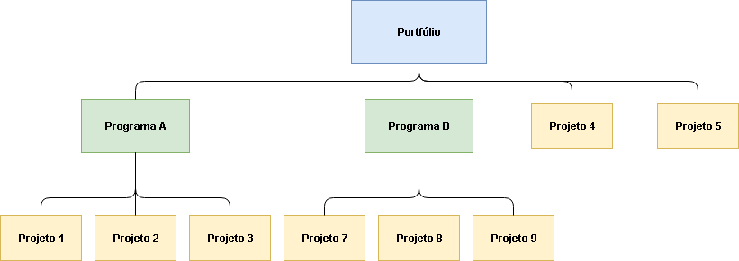

# Aula 2

## Projetos vs Processos
A primeira coisa importante é saber diferenciar quando está falando de um projeto e um processo.  

| Projetos                  | Processos                  |
| ------------------------- | -------------------------- |
| Esforço temporário        | Esforço contínuo           |
| Produz valor ao seu final | Produz valor imediatamente |
| Único                     | Repetitivo                 |
| Resultado imprevisível    | Resultado previsível       |

### Projetos
Projetos são planejados e executados, afím de alcançar um objetivo. Ao alcançar esse objetivo não precisamos mais trabalhar nesse projeto, por isso os projetos tem **esforço temporário**.  
Enquanto você está trabalhando para o projeto ficar pronto, você não tem nenhum tipo de lucro. Como o seu projeto não está fazendo o que deveria, não está lhe dando nada. Por isso **produz valor ao seu final**.  
Ele é **único** pois o objetivo costuma ser único. Você está tentando alcançar um objetivo no projeto e depois de alcança-lo você não precisa trata-lo de novo.  
Você nunca sabe como um projeto vai acabar, se vai alcançar o objetivo. Por isso **resultado imprevisível**.  

### Processos
Processos tem que executar o mesmo tipo de tarefa sempre que recebem uma determinada entrada. Como não tem previsão de parar é **esforço contínuo**.  
Ao terminar sua primeira tarefa, já executou seu proposito uma vez. Todas vezes que executa a tarefa já está lucrando, por isso **produz valor imediatamente**.  
Como a tarefa é sempre a mesma, processos são **repetitivos**.  
Ao ter que fazer uma tarefa, o processo sabe como vai ser todo o percurso da tarefa, por isso o **resultado é previsível**.  

## De onde surgem os projetos?
Um resumo seria "os projetos surgem por necessidade de alguém". Os pontos listados em aula são:  

* Demanda de mercado
* Solicitação de cliente
* Necessidade organizacional
* Avanço tecnológico
* Requisito legal
* Necessidade social

## Definição de Portfólio, Programa e Projeto

Se você ficar em dúvida de quem é o pai, basta botar em ordem alfabética.  
Portfólio é pai de Programa e Projeto.  
Programa é pai de Projeto.  
Projeto é sempre o filho.  

**Projeto**: Já vimos no início da aula o que é.  
**Programa**: Um conjuto de projetos, como um objetivo pode ser difícil de ser alcança com apenas um projeto, dividimos em varios projetos menores e mais fáceis de serem feitos.  
**Portfólio**: Um conjunto de programas e projetos afim de alcançar o objetivo final(?).  

---
---
---

## Gerenciamento de Projetos
É nada mais que usar os conhecimentos, habilidades, ferramentas e técnicas para atender os requisitos do projeto.  

## Escritório de Projetos
> É uma entidade a qual são atribuídas várias responsabilidades relacionadas ao gerenciamento centralizado dos projetos sob seu domínio.  

Uma pessoa ou grupo de pessoas responsáveis por gerenciar parte ou o projeto.  

## Restrições em projetos

---
---
---

Siglas  
PMI = Project Management Institute  
PMBOK = Project Management Body of Knowledge  
PMP = Project Management Profissional  
GP = Gerencia de Projetos  

## As 10 Áreas de Conhecimento do PMI
