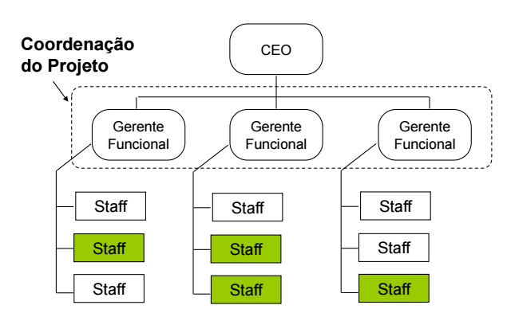
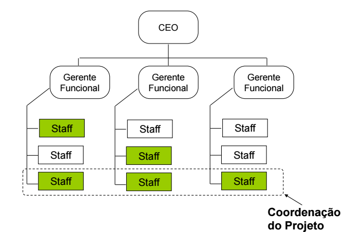

# Aula 4

## O ciclo de vida dos projetos

### Iniciação
**Termo de abertura**  
**PM Canvas**: Project Manager Canvas  
**Identificação dos Stakeholders**: Identificação de quem são as partes interessadas do projeto (são 4 tipos e vamos aprender a identificar cada um deles)  

### Planejamento
**PGP**  
**EAP**: Estrutura Analitica do Projeto  
**Declaração de Escopo**: Formaliza o que vai fazer no projeto (vai dizer o que você não vai fazer no projeto)  
**Aprovação do Plano do Projeto**  
**Reunião de Partida (Kick Off Meeting)**  
**Linhas de Base (baselines)**: Existe 3 linhas de base (linha de escopo, linha de tempo, linha de custo)  

### Execução e controle
**Progresso**  
**Controle de Mudanças**: Proteger o projeto do que foi previamente planejado  
**Entregas Parciais**  

### Encerramento
**Compilação das Lições Aprendidas**: Note que você vai anotando as lições aprendidas durante todo o ciclo, aqui é apenas a compilação  
**Entrega do Produto Final**  
**Aprovação do Cliente**  
**Fechamento dos Contratos**  

## Influências Organizacionais
Como a estrutura da empresa atrapalha ou ajuda a gerênciar projetos.  

### Organização Funcional
Cada coluna de Gerente Funcional é um área (por exemplo, área de TI, área de Engenharia, ...).  
Cada Staff em amarelo foi a pessoa selecionada da área para o projeto.  

Vantagens:
* Garante que vai ter o recurso técnico. Já que Gerente Funcional é chefe da Staff, a Staff não pode recusar trabalhar no projeto(ao menos que queira ser demitido).  
Desvantagens:
* Gerente Funcional já tem que gerênciar as áreas deles, agora vai ter que gerênciar projetos também.  

### Organização de Matriz Fraca

