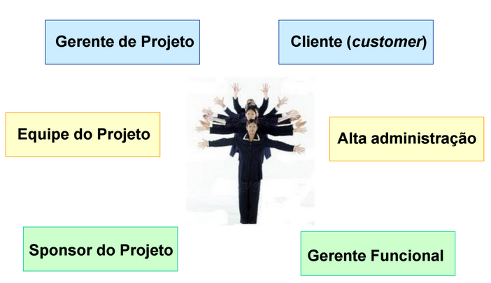

# Aula 6

## Stakeholder
Em português "partes interessadas".

É um indivíduo **ou** grupo **ou** organização.  
Stakeholder pode afetar **ou** ser afetado por uma decisão/resultado do projeto.  
Stakeholder pode ser afetados ou afetar de maneira positiva **ou** negativa.  

---

Importante notar que stakeholder é apenas aqueles afetados diretamente pelo projeto. Exemplo:   
Seu projeto é um filme.  
Exemplos de stakeholders: O fornecedor de lugar para filmar o filme, a empresa que vai fazer os efeitos do filme, camerman, diretor, ator, quem vai vender comida para a sua equipe que ta fazendo o filme, roterista...  
Exemplos de **não** stakeholders: A pessoa que vê o filme, cachorro, lojas perto do cinema...  

Note que embora as pessoas que vejam o filme façam diferença pro filme ser um sucesso, não é o que estamos procurando quando fazemos o filme. Procuramos saber todos que afetam a produção do filme, uma vez que o filme está pronto, o problema é da pessoa que pediu para você projetar o filme. Se fosse nosso problema, não estariamos **gerenciando um projeto**, mas sim um **processo**.  

---

### Principais stakeholders

**Gerente de Projeto**  
Obviamente alguém que está trabalhando como Gerente de um Projeto quer que esse projeto vá bem.  

**Cliente(customer)**  
Cliente **não** é todo o mercado que vai consumir aquele produto, geralmente o cliente é quem contratou e é afetado diretamente pelo projeto.  
Muitas vezes o cliente é o patrocinador.  

**Equipe do Projeto**  
Sem uma equipe para fazer o projeto, você não tem como fazer o projeto existir.  

**Alta administração**  
É ela que costuma conhecer/descobrir o patrocinador. Nem sempre todos da administração estão favoraveis ao seu projeto, você precisa saber quem são essas pessoas para conseguir o apoio delas.  

**Sponsor do Projeto (patrocinador)**  

**Gerente Funcional**  
Lembre das matrizes, nelas os gerentes funcionais controlam uma área e se queremos ter recurso para o nosso projeto então precisamos estar de bem com eles.  

### Stakeholders primários

---

Gerente de Projeto não entra na matriz de stakeholders pois teremos que desenvolver uma estratégia para cada stakeholder na matriz,  não faz sentido fazer uma estratégia para si mesmo. No caso do patrocinador você tem que desenvolver uma estratégia para que ele continue patrocinando.  
