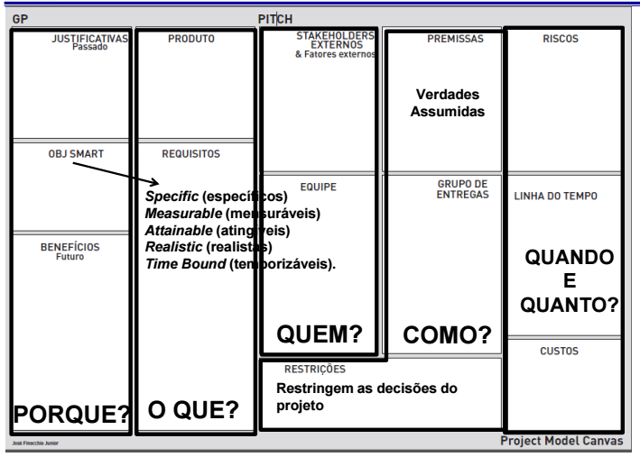

# Aula 6

## Project Model Canvas
Mistura entre **Termo de Abertura** com a **Matriz Stakeholder**.  
A idéia é fácilmente  transmitir informação sobre o projeto para a equipe. Normalmente o termo de abertura é feito pelo Gerente de Projeto e o Dono/Patrocinador, não incluindo a equipe (nosso caso fizemos o termo de abertura já com a equipe).  
Muitos dos campos do Project Model Canvas se repetem do Termo de Abertura para que a equipe tenha as informações necessárias, mas tem alguns novos.  

* Justificativas: Mesmo do termo de abertura.   
* Obj Smart: O objetivo que o projeto quer alcançar.  
* Benefícios: Quais os benefícios que o seu projeto vai trazer.  
* Produto: O que é o produto.  
* Requisitos: Requisitos funcionais e não funcionais (não no nivel final, apenas uma coisa simples).  
* Stakeholders Externos: Stakeholders.  
* Equipe: Membros da equipe, pessoas que vão trabalhar no projeto.  
* Premissas: Mesmo do termo de abertura.  
* Grupo de Entregas: Mesmo do termo de abertura.  
* Restrições: Mesmo do termo de abertura.  
* Riscos: Mesmo do termo de abertura.  
* Linha do Tempo: Mesmo do termo de abertura.  
* Custos: Mesmo do termo de abertura.  

