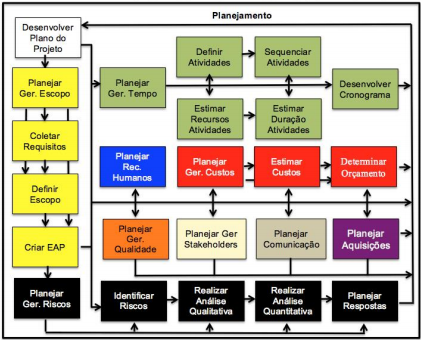
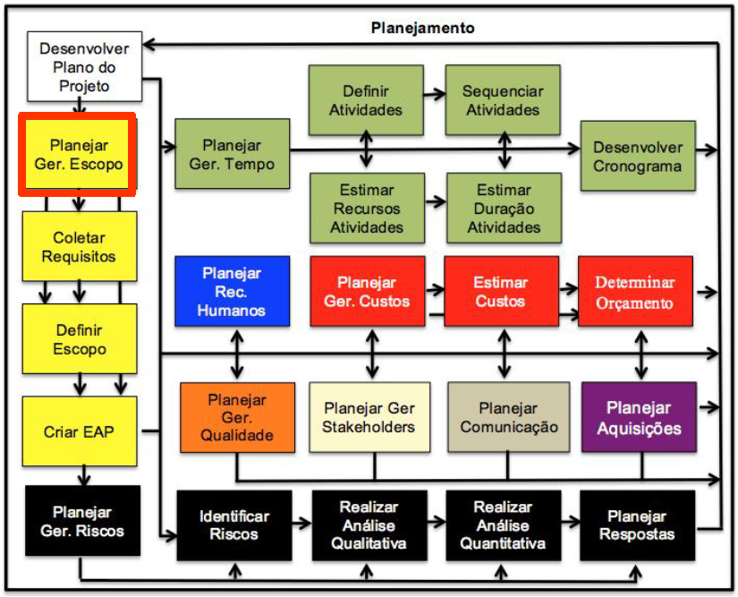
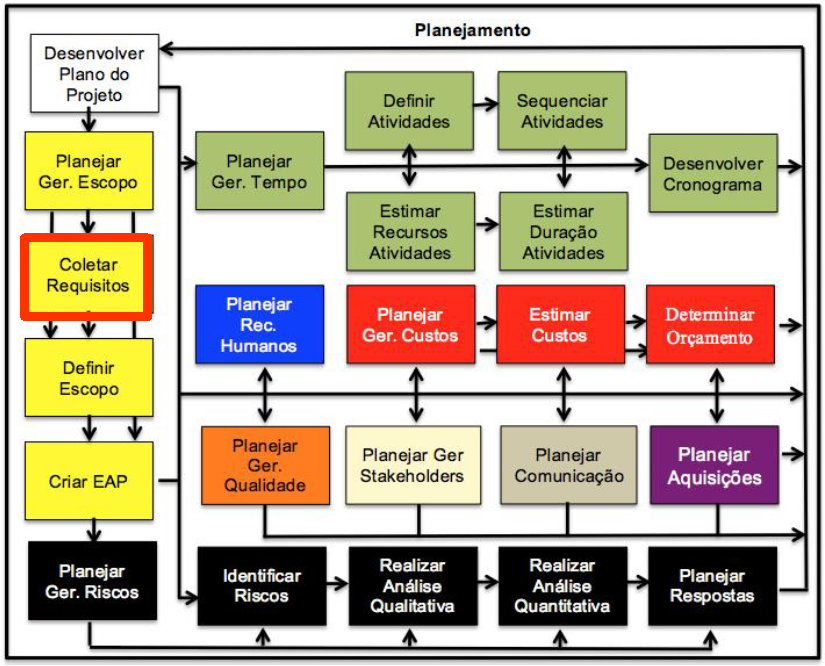

# Aula 7
Vamos começar a ver dentro de **Planejamento**.  
  

---

---

## Coletar requisitos

### Requisito funcionais  
Descreve uma funcionalidade do sistema, uma função que o sistema tem que ter, ou melhor, que o usuário/stakeholder quer que exista no sistema.  
Não confundir com "como o seu programa precisa fazer", vamos supor que seu programa seja uma calculadora simples.  
Sua calculadora precisa exibir o resultado.  
Sua calculadora precisa receber valores.  
Sua calculadora precisa aplicar operações matemáticas.  

Note que nada disso é especifico, por exemplo:  
Sua calculadora precisa ser feita em Java.  
Sua calculadora precisa responder em menos de 1 segundo.  

Esses ultimos **não** são funcionais.  

### Requisito não funcional  
São o que o sistema vai ter, ou como vai ser feito, caracteristicas do sistema.  
Pegando o exemplo anterior:  
Sua calculadora precisa ser feita em Java.  
Sua calculadora precisa responder em menos de 1 segundo.  

Existem 3 tipos de subcategorias de requisitos não funcionais:  
* Produto: Especifica o comportamento do software  
* Organizacional: Se adpatar a obrigações da empresa  
* Externo: Derivados de coisas externas ao sistema  

[Wikipedia dos requisitos não funcionais](https://pt.wikipedia.org/wiki/Requisito_n%C3%A3o_funcional)
